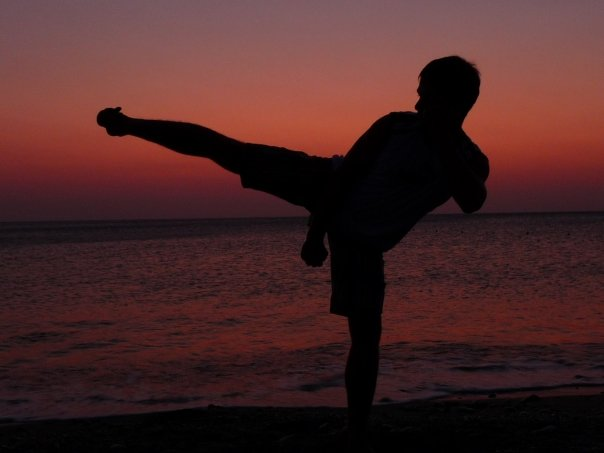

# Juri Strumpflohner	

<figure>
    
    <figcaption>My passion..</figcaption>
</figure>

Currently Juri works as a [software architect](http://careers.stackoverflow.com/juristr) at a local, south-tyrolean e-government company. Beside being a coding geek,
he is always in search for new interesting technologies with a major
interest in rich web client development with JavaScript and mobile applications. He's
also an active [blogger](http://blog.js-development) and participates in online communities
such as [StackOverflow](http://stackoverflow.com/users/50109/juri). Well, that's it. For more
detailled information keep an eye on his [CV](http://careers.stackoverflow.com/juristr).

In his free time, Juri is a passionate martial arts practitioner. He's been practicing Yoseikan Budo
now for roughly over 12 years and owns a black belt (2nd DAN).

You can find him

- on [Twitter](http://twitter.com/juristr)
- on [GitHub](http://github.com/juristr)
- on [Stack Overflow](http://stackoverflow.com/users/50109/juri)
- on [Geekli.st](https://geekli.st/juri)
- on [Facebook](https://www.facebook.com/pages/Juri-Strumpflohners-TechBlog/157432560964701)
- on ...

or just drop him a line at <juri.strumpflohner@js-development.com>.

  

    
  

  

          
  

  

          
  

 This work is licensed under a <a rel="license" href="http://creativecommons.org/licenses/by-nc-sa/3.0/it/deed.en_US">Creative Commons Attribution-NonCommercial-ShareAlike 3.0 Italy License</a>.

